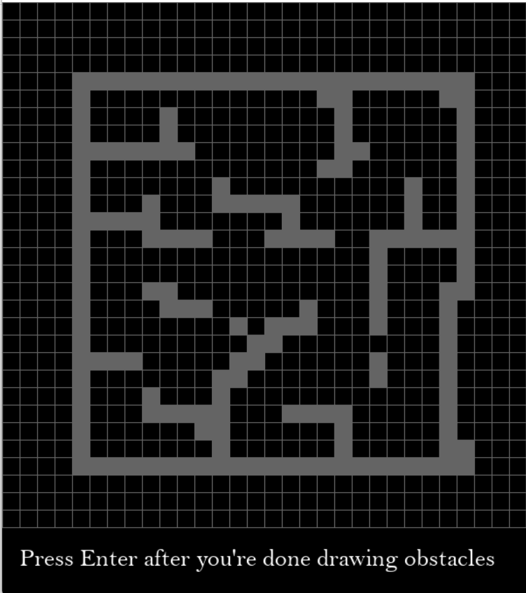
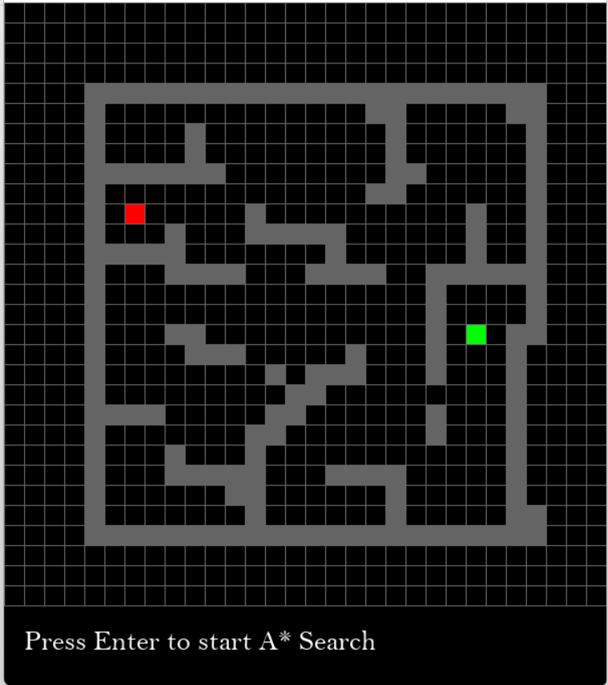
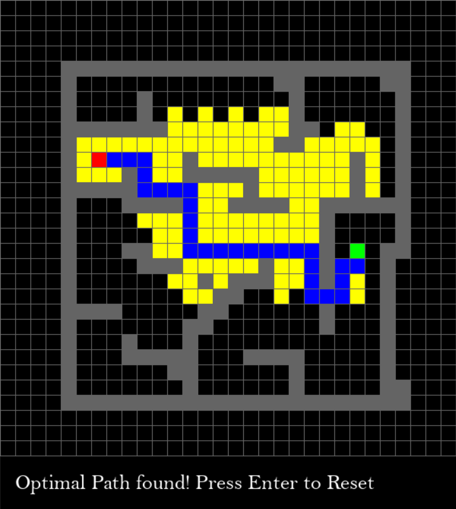

# A-Star-Maze-Solver
Visualization of A* Algorithm while solving a custom-made maze using Python.

A* is a type of Informed Search Algorithm; a class of Searching Algorithms that contains an array of knowledge such as how far we are from the goal, path cost, how to reach to goal node, etc. This knowledge help agents to explore less to the search space and find more efficiently the goal node. A* algorithm makes use of a heuristic function (a function that indicates how far the current state/node is from the goal node/state.

Requirements:
- python=3.7 or higher
- pygame=2.0.1

Here's how it looks:

- User can draw the maze/obstacles

- User can select the starting (red) and ending (green) points

- Watch A* at work! The optimal path is highlighted in blue and the yellow squares show the nodes explored by the algorithm.

